# Steps to Create the Sample

## Prerequisites

- Unreal Engine 4.23 or later
- Microsoft Visual Studio or Xcode( version required by Unreal Engine )
- A Windows device running Windows 7 or later or Mac device
- A valid Agora account. (<a href="https://dashboard.agora.io/?_ga=2.169392609.1139696370.1573117530-1815680581.1567671681" target="_blank">Sign up</a> for free)

#### Open the specified ports in Firewall Requirements if your network has a firewall.

<a href="https://docs.agora.io/en/Agora%20Platform/firewall?platform=All%20Platforms" target="_blank">Firewall Requirements</a>


## New Project

In this section, we will create an Unreal Engine project and integrate the plugin into the project.

- [Create a project](#create-a-project)
- [Installation](#installation)
- [Create a New Level](#create-a-new-level)

### Create a project

Now, let's build a project from scratch. Skip to **Installation** if a project already exists.

1. Open **Unreal Engine Editor** and click **New project**.
2. On the **New Project** panel, choose C++ as the project type, input the project name, choose the project location, and click **Create Project**.


3. Make sure to uncomment the PrivateDependencyModuleNames line in [your_project]/Source/[project_name]/[project_name].Build.cs file. Unreal comments this out by default, and causes a compile error if left commented out.

```cs
	// Uncomment if you are using Slate UI
	PrivateDependencyModuleNames.AddRange(new string[] { "UMG", "Slate", "SlateCore" });
```

### Installation

Follow these steps to integrate the Agora Plugin into your project.

1. Copy the plugin to [your_project]/Plugins
2. Add plugin dependency into [your_project]/Source/[project_name]/[project_name].Build.cs file, Private Dependencies section
`PrivateDependencyModuleNames.AddRange(new string[] { "AgoraPlugin" });`
3. Restart **Unreal Engine** (if it is running).
4. Go to **Edit->Plugins**. Find category **Project->Other** and make sure plugin is enabled.


### Create a New Level

Next we will create a new Level to build our game environment there. 
There are several different ways in which you can create a new Level, we will use the File Menu method, which lists level selection options.

Inside the Unreal Editor, click the File Menu option then select New Level...
	
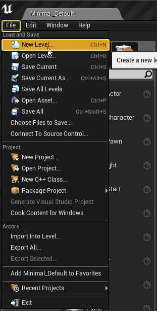

This will open the New Level dialog window: 

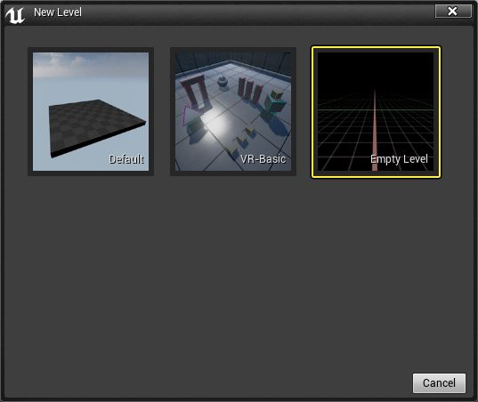

Click the Empty Level to select it. 

Save it to the prefered folder, for example like /Content/Levels/VideoCallLevel.umap


## Create Core Classes

Create classes that will handle communication with the Agora SDK.

- [Create VideoFrameObserver](#create-videoframeobserver)
- [Create VideoCall C++ Class](#create-videocall-c-class)

### Create VideoFrameObserver

VideoFrameObserver implements agora::media::IVideoFrameObserver.
The methods in the VideoFrameObserver class manage video frames callbacks.
Should be registered in agora::media::IMediaEngine using registerVideoFrameObserver function.

- [Create VideoFrameObserver class interface](#create-videoframeobserver-class-interface)
- [Override the onCaptureVideoFrame/onRenderVideoFrame Methods](#override-the-oncapturevideoframeonrendervideoframe-methods)
- [Add the setOnCaptureVideoFrameCallback/setOnRenderVideoFrameCallback Methods](#add-the-setoncapturevideoframecallbacksetonrendervideoframecallback-methods)

In Unreal Engine Editor clic **File->Add New C++ Class**.

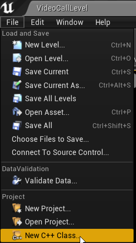

Select **None** as a parent class and click **Next**, 

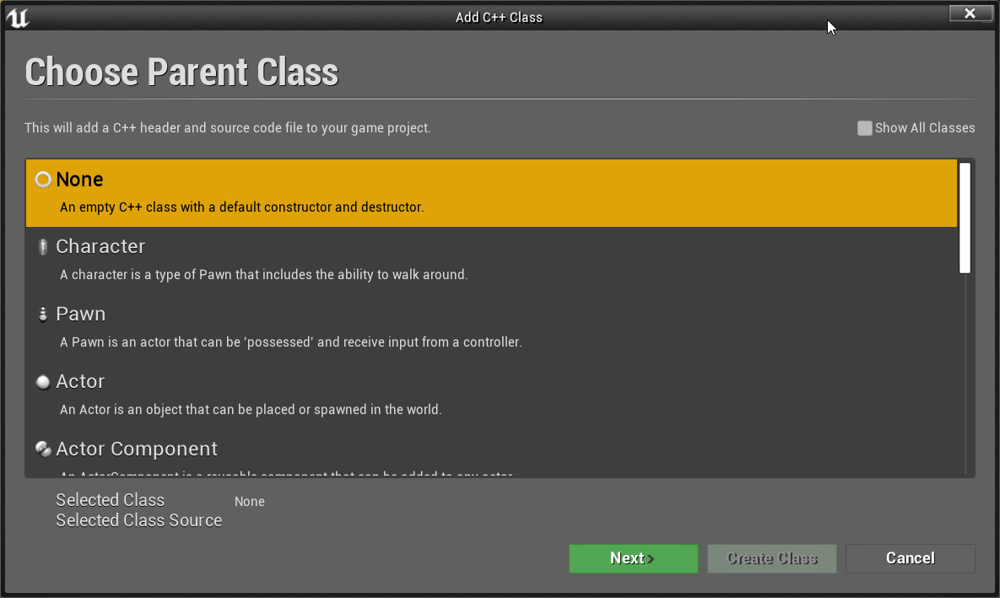

Name class **VideoFrameObserver** and click **Create Class** 

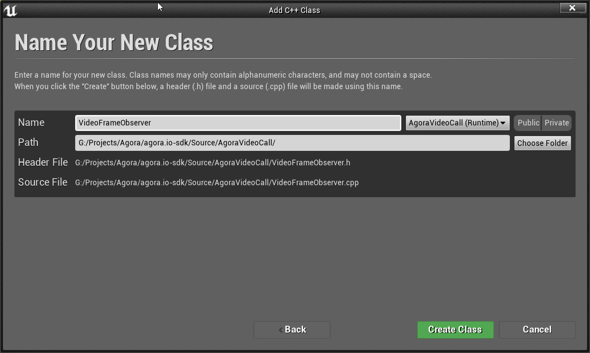

##### Create VideoFrameObserver class interface

Open **VideoFrameObserver.h** file and add such interface:

```cpp
//VideoFrameObserver.h

#include "CoreMinimal.h"

#include <functional>

#include "AgoraMediaEngine.h"

class AGORAVIDEOCALL_API VideoFrameObserver : public agora::media::IVideoFrameObserver
{
public:
	virtual ~VideoFrameObserver() = default;
public:
	bool onCaptureVideoFrame(VideoFrame& videoFrame) override;

	bool onRenderVideoFrame(unsigned int uid, VideoFrame& videoFrame) override;

	void setOnCaptureVideoFrameCallback(
		std::function<void(std::uint8_t*, std::uint32_t, std::uint32_t, std::uint32_t)> callback);

	void setOnRenderVideoFrameCallback(
		std::function<void(std::uint8_t*, std::uint32_t, std::uint32_t, std::uint32_t)> callback);

	virtual VIDEO_FRAME_TYPE getVideoFormatPreference() override { return FRAME_TYPE_RGBA; }
	
private:

	std::function<void(std::uint8_t*, std::uint32_t, std::uint32_t, std::uint32_t)> OnCaptureVideoFrame;
	std::function<void(std::uint8_t*, std::uint32_t, std::uint32_t, std::uint32_t)> OnRenderVideoFrame;
};
```

Note that `AGORAVIDEOCALL_API` is a Project dependent define. Instead of this use your own define generated by Unreal.

##### Override the onCaptureVideoFrame/onRenderVideoFrame Methods

Function onCaptureVideoFrame retrieves the camera captured image, converts to ARGB format and triggers OnCaptureVideoFrame callback.
Function onRenderVideoFrame converts received image of the specified user to ARGB format and triggers OnRenderVideoFrame callback.

```cpp
//VideoFrameObserver.cpp

bool VideoFrameObserver::onCaptureVideoFrame(VideoFrame& Frame)
{
   const auto BufferSize = Frame.yStride*Frame.height;

	if (OnCaptureVideoFrame)
	{
		OnCaptureVideoFrame( static_cast< uint8_t* >( Frame.yBuffer ), Frame.width, Frame.height, BufferSize );
	}
   
	return true;
}

bool VideoFrameObserver::onRenderVideoFrame(unsigned int uid, VideoFrame& Frame)
{
	const auto BufferSize = Frame.yStride*Frame.height;

	if (OnRenderVideoFrame)
	{
		OnRenderVideoFrame( static_cast<uint8_t*>(Frame.yBuffer), Frame.width, Frame.height, BufferSize );
	}

	return true;
}
```

##### Add the setOnCaptureVideoFrameCallback/setOnRenderVideoFrameCallback Methods

Set callbacks to retrieve the camera captured image/the received image of the remote user.

```cpp
//VideoFrameObserver.cpp

void VideoFrameObserver::setOnCaptureVideoFrameCallback(
	std::function<void(std::uint8_t*, std::uint32_t, std::uint32_t, std::uint32_t)> Callback)
{
	OnCaptureVideoFrame = Callback;
}

void VideoFrameObserver::setOnRenderVideoFrameCallback(
	std::function<void(std::uint8_t*, std::uint32_t, std::uint32_t, std::uint32_t)> Callback)
{
	OnRenderVideoFrame = Callback;
}
```

### Create VideoCall C++ Class

The VideoCall class manages communication with the Agora SDK.

- [Create Class Interface](#create-class-interface)
- [Create Initializing Methods](#create-initializing-methods)
- [Create Callbacks Methods](#create-backs-methods)
- [Create Call Methods](#create-call-methods)
- [Create Video Methods](#create-video-methods)
- [Create Audio Methods](#create-audio-methods)

#### Create Class Interface

Return to Unreal Engine Editor and create new C++ class as you did in previous step, call it **VideoCall.h**.

Go to **VideoCall.h** file and add such interface:

```cpp
//VideoCall.h

#pragma once

#include "CoreMinimal.h"

#include <functional>
#include <vector>

#include "AgoraRtcEngine.h"
#include "AgoraMediaEngine.h"

class VideoFrameObserver;

class AGORAVIDEOCALL_API VideoCall
{
public:
	VideoCall();
	~VideoCall();

	FString GetVersion() const;

	void RegisterOnLocalFrameCallback(
		std::function<void(std::uint8_t*, std::uint32_t, std::uint32_t, std::uint32_t)> OnLocalFrameCallback);
	void RegisterOnRemoteFrameCallback(
		std::function<void(std::uint8_t*, std::uint32_t, std::uint32_t, std::uint32_t)> OnRemoteFrameCallback);

	void StartCall(
		const FString& ChannelName,
		const FString& EncryptionKey,
		const FString& EncryptionType);

	void StopCall();

	bool MuteLocalAudio(bool bMuted = true);
	bool IsLocalAudioMuted();

	bool MuteLocalVideo(bool bMuted = true);
	bool IsLocalVideoMuted();

	bool EnableVideo(bool bEnable = true);

private:
	void InitAgora();

private:
	TSharedPtr<agora::rtc::ue4::AgoraRtcEngine> RtcEnginePtr;
	TSharedPtr<agora::media::ue4::AgoraMediaEngine> MediaEnginePtr;

	TUniquePtr<VideoFrameObserver> VideoFrameObserverPtr;

	//callback
	//data, w, h, size
	std::function<void(std::uint8_t*, std::uint32_t, std::uint32_t, std::uint32_t)> OnLocalFrameCallback;
	std::function<void(std::uint8_t*, std::uint32_t, std::uint32_t, std::uint32_t)> OnRemoteFrameCallback;

	bool bLocalAudioMuted = false;
	bool bLocalVideoMuted = false;
};
```

#### Create Initializing Methods

Go to **VideoCall.cpp** file and add required includes.

```cpp
//VideoCall.cpp

#include "AgoraVideoDeviceManager.h"
#include "AgoraAudioDeviceManager.h"

#include "MediaShaders.h"

#include "VideoFrameObserver.h"
```

Create the engine using agora::rtc::ue4::AgoraRtcEngine::createAgoraRtcEngine() and initialize the RtcEnginePtr variable.
Create a RtcEngineContext object and set the event handler and App ID properties ctx.eventHandler and ctx.appId. 
Initialize the engine with ctx using RtcEnginePtr->initialize().
Create a AgoraMediaEngine object  and initialize the MediaEnginePtr variable.

```cpp
//VideoCall.cpp

VideoCall::VideoCall()
{
	InitAgora();
}

VideoCall::~VideoCall()
{
	StopCall();
}

void VideoCall::InitAgora()
{
	RtcEnginePtr = TSharedPtr<agora::rtc::ue4::AgoraRtcEngine>(agora::rtc::ue4::AgoraRtcEngine::createAgoraRtcEngine());

	static agora::rtc::RtcEngineContext ctx;
	ctx.appId = "aab8b8f5a8cd4469a63042fcfafe7063";
	ctx.eventHandler = new agora::rtc::IRtcEngineEventHandler();

	int ret = RtcEnginePtr->initialize(ctx);
	if (ret < 0)
	{
		UE_LOG(LogTemp, Warning, TEXT("RtcEngine initialize ret: %d"), ret);
	}
	MediaEnginePtr = TSharedPtr<agora::media::ue4::AgoraMediaEngine>(agora::media::ue4::AgoraMediaEngine::Create(RtcEnginePtr.Get()));
}

FString VideoCall::GetVersion() const
{
	if (!RtcEnginePtr)
	{
		return "";
	}
	int build = 0;
	const char* version = RtcEnginePtr->getVersion(&build);
	return FString(ANSI_TO_TCHAR(version));
}
```

#### Create Callbacks Methods

Set callback function, to return local and remote frames

```cpp
//VideoCall.cpp

void VideoCall::RegisterOnLocalFrameCallback(
	std::function<void(std::uint8_t*, std::uint32_t, std::uint32_t, std::uint32_t)> OnFrameCallback)
{
	OnLocalFrameCallback = std::move(OnFrameCallback);
}

void VideoCall::RegisterOnRemoteFrameCallback(
	std::function<void(std::uint8_t*, std::uint32_t, std::uint32_t, std::uint32_t)> OnFrameCallback)
{
	OnRemoteFrameCallback = std::move(OnFrameCallback);
}
```

#### Create Call Methods

The methods in this section manage joining or leaving a channel 

##### Add StartCall function

Create VideoFrameObserver object, register  the following callbacks according to your scenarios:

	-`OnLocalFrameCallback`: Occurs each time the SDK receives a video frame captured by the local camera.
	
	-`OnRemoteFrameCallback`: Occurs each time the SDK receives a video frame sent by the remote user.

Then in function InitAgora register VideoFrameObserver object in MediaEngine object with `registerVideoFrameObserver` method.
In case EncryptionType and EncryptionKey are not empty, set EncryptionMode and EncryptionSecret for RtcEngine, then set channel profile according to your needs and call joinChannel.

```cpp
//VideoCall.cpp

void VideoCall::StartCall(
	const FString& ChannelName,
	const FString& EncryptionKey,
	const FString& EncryptionType)
{
	if (!RtcEnginePtr)
	{
		return;
	}
	if (MediaEnginePtr)
	{
		if (!VideoFrameObserverPtr)
		{
			VideoFrameObserverPtr = MakeUnique<VideoFrameObserver>();

			std::function<void(std::uint8_t*, std::uint32_t, std::uint32_t, std::uint32_t)> OnCaptureVideoFrameCallback
				= [this](std::uint8_t* buffer, std::uint32_t width, std::uint32_t height, std::uint32_t size)
			{
				if (OnLocalFrameCallback)
				{
					OnLocalFrameCallback(buffer, width, height, size);
				}
				else { UE_LOG(LogTemp, Warning, TEXT("VideoCall OnLocalFrameCallback isn't set")); }
			};
			VideoFrameObserverPtr->setOnCaptureVideoFrameCallback(std::move(OnCaptureVideoFrameCallback));

			std::function<void(std::uint8_t*, std::uint32_t, std::uint32_t, std::uint32_t)> OnRenderVideoFrameCallback
				= [this](std::uint8_t* buffer, std::uint32_t width, std::uint32_t height, std::uint32_t size)
			{
				if (OnRemoteFrameCallback)
				{
					OnRemoteFrameCallback(buffer, width, height, size);
				}
				else { UE_LOG(LogTemp, Warning, TEXT("VideoCall OnRemoteFrameCallback isn't set")); }
			};
			VideoFrameObserverPtr->setOnRenderVideoFrameCallback(std::move(OnRenderVideoFrameCallback));
		}

		MediaEnginePtr->registerVideoFrameObserver(VideoFrameObserverPtr.Get());
	}

    int nRet = RtcEnginePtr->enableVideo();
    if (nRet < 0)
    {
        UE_LOG(LogTemp, Warning, TEXT("enableVideo : %d"), nRet)
    }

	if (!EncryptionType.IsEmpty() && !EncryptionKey.IsEmpty())
	{
		if (EncryptionType == "aes-256")
		{
			RtcEnginePtr->setEncryptionMode("aes-256-xts");
		}
		else
		{
			RtcEnginePtr->setEncryptionMode("aes-128-xts");
		}

		nRet = RtcEnginePtr->setEncryptionSecret(TCHAR_TO_ANSI(*EncryptionKey));
		if (nRet < 0)
		{
			UE_LOG(LogTemp, Warning, TEXT("setEncryptionSecret : %d"), nRet)
		}
	}

	nRet = RtcEnginePtr->setChannelProfile(agora::rtc::CHANNEL_PROFILE_COMMUNICATION);
	if (nRet < 0)
	{
		UE_LOG(LogTemp, Warning, TEXT("setChannelProfile : %d"), nRet)
	}
	//"demoChannel1";
	std::uint32_t nUID = 0;
	nRet = RtcEnginePtr->joinChannel(NULL, TCHAR_TO_ANSI(*ChannelName), NULL, nUID);
	if (nRet < 0)
	{
		UE_LOG(LogTemp, Warning, TEXT("joinChannel ret: %d"), nRet);
	}
}
```

##### Add StopCall function

Call the `leaveChannel` method to leave the current call according to your scenario, for example, when the call ends, when you need to close the app, or when your app runs in the background.
Call `registerVideoFrameObserver` with nullptr argument to cancel the registration of the VideoFrameObserver.

```cpp
//VideoCall.cpp

void VideoCall::StopCall()
{
	if (!RtcEnginePtr)
	{
		return;
	}
	auto ConnectionState = RtcEnginePtr->getConnectionState();
	if (agora::rtc::CONNECTION_STATE_DISCONNECTED != ConnectionState)
	{
		int nRet = RtcEnginePtr->leaveChannel();
		if (nRet < 0)
		{
			UE_LOG(LogTemp, Warning, TEXT("leaveChannel ret: %d"), nRet);
		}
		if (MediaEnginePtr)
		{
			MediaEnginePtr->registerVideoFrameObserver(nullptr);
		}
	}
}
```

#### Create Video Methods

The methods in this section manage the video.

##### Add the EnableVideo() Method

The `EnableVideo()` method enables the video for the sample application.
Initialize `nRet` with a value for `0`. If `bEnable` is `true`, enable the video using `RtcEnginePtr->enableVideo()`. Otherwise, disable the video using `RtcEnginePtr->disableVideo()`.

```cpp
//VideoCall.cpp

bool VideoCall::EnableVideo(bool bEnable)
{
	if (!RtcEnginePtr)
	{
		return false;
	}
	int nRet = 0;
	if (bEnable)
		nRet = RtcEnginePtr->enableVideo();
	else
		nRet = RtcEnginePtr->disableVideo();
	return nRet == 0 ? true : false;
}
```

##### Add the MuteLocalVideo() Method

The `MuteLocalVideo()` method turns local video on or off.
Ensure `RtcEnginePtr` is not `nullptr` before completing the remaining method actions.
If the mute or unmute local video is successful, set `bLocalVideoMuted` to `bMuted`.

```cpp
//VideoCall.cpp

bool VideoCall::MuteLocalVideo(bool bMuted)
{
	if (!RtcEnginePtr)
	{
		return false;
	}
	int ret = RtcEnginePtr->muteLocalVideoStream(bMuted);
	if (ret == 0)
		bLocalVideoMuted = bMuted;

	return ret == 0 ? true : false;
}
```

##### Add the IsLocalVideoMuted() Method

The `IsLocalVideoMuted()` method indicates if the local video is on or off for the sample application, returning `bLocalVideoMuted`.

```cpp
//VideoCall.cpp

bool VideoCall::IsLocalVideoMuted()
{
	return bLocalVideoMuted;
}
```


#### Create Audio Methods

The methods in this section manage the audio.

##### Add the MuteLocalAudio() Method

The `MuteLocalAudio()` method mutes or unmutes the local audio.
Ensure `RtcEnginePtr` is not `nullptr` before completing the remaining method actions.
If the mute or unmute local audio is successful, set `bLocalAudioMuted` to `bMuted`.

```cpp
//VideoCall.cpp

bool VideoCall::MuteLocalAudio(bool bMuted)
{
	if (!RtcEnginePtr)
	{
		return false;
	}
	int ret = RtcEnginePtr->muteLocalAudioStream(bMuted);
	if (ret == 0)
		bLocalAudioMuted = bMuted;

	return ret == 0 ? true : false;
}

```

##### Add the IsLocalAudioMuted() Method

The `IsLocalAudioMuted()` method indicates if local audio is muted or unmuted for the sample application, returning `bLocalAudioMuted`.

```cpp
//VideoCall.cpp

bool VideoCall::IsLocalAudioMuted()
{
	return bLocalAudioMuted;
}
```

## Create GUI

Create the user interface (UI) for the one-to-one call in your project.

- [Create VideoCallPlayerController](#create-videocallplayercontroller)
- [Create EnterChannelWidget C++ Class](#create-enterchannelwidget-c-class)
- [Create VideoViewWidget C++ Class](#create-videoviewwidget-c-class)
- [Create VideoCallViewWidget C++ Class](#create-videocallviewwidget-c-class)
- [Create VideoCallWidget C++ Class](#create-videocallwidget-c-class)
- [Create BP_EnterChannelWidget blueprint asset](#create-bp_enterchannelwidget-blueprint-asset)
- [Create BP_VideoViewWidget Asset](#create-bp_videoviewwidget-asset)
- [Create BP_VideoCallViewWidget Asset](#create-bp_videocallviewwidget-asset)
- [Create BP_VideoCallWidget Asset](#create-bp_videocallwidget-asset)
- [Create BP_VideoCallPlayerController blueprint asset](#create-bp_videocallplayercontroller-blueprint-asset)
- [Create BP_AgoraVideoCallGameModeBase Asset](#create-bp_agoravideocallgamemodebase-asset)
- [Modify Game Mode](#modify-game-mode)

### Create VideoCallPlayerController

To be able to add our Widget Blueprints to the Viewport, we create our custom player controller class.

On the Content browser, press the Button **Add New**, and select **New C++ Class**.
On the **Add C++ Class** window, tick the button Show All Classes, and type PlayerController. 
Press the **Next** Button and name the class **VideoCallPlayerController**. Press the **Create Class** Button.

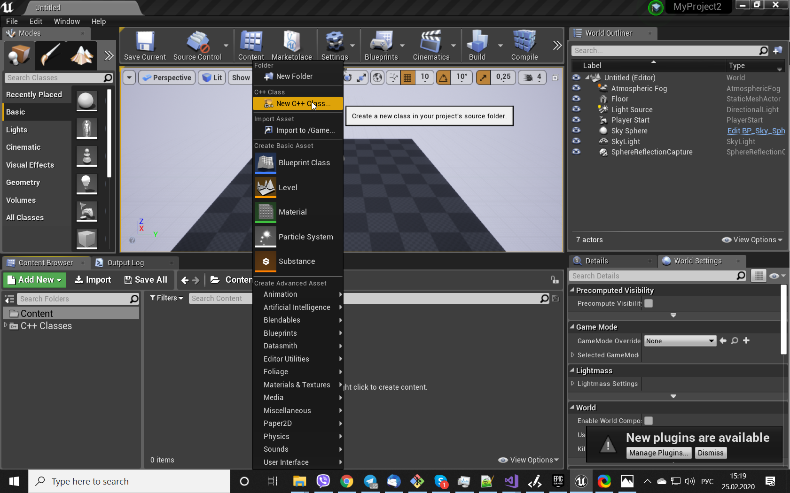
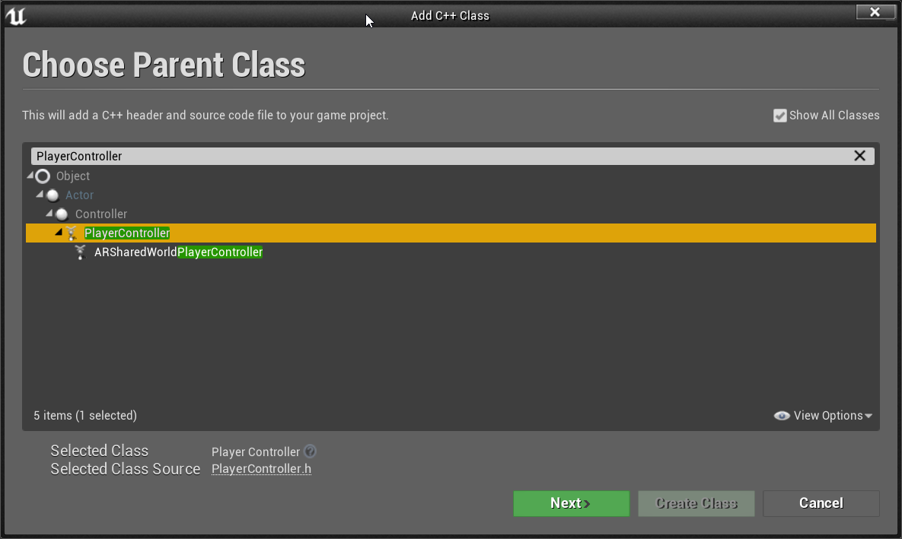


```cpp
//VideoCallPlayerController.h

#include "CoreMinimal.h"
#include "GameFramework/PlayerController.h"
#include "VideoCallPlayerController.generated.h"

UCLASS()
class AGORAVIDEOCALL_API AVideoCallPlayerController : public APlayerController
{
	GENERATED_BODY()
	
public:
};
```

This class is a base class for BP_VideoCallPlayerController blueprint asset, that we will be created in the end.

- [Add Requered Includes](#add-requered-includes)
- [Class Declaration](#class-declaration)
- [Create Callbacks Methods](#create-backs-methods)
- [Override BeginPlay/EndPlay](#override-beginplayendPlay)
- [Add StartCall/EndCall Methods](#add-startcallendcall-methods)
- [Add Switch On Another Widget Methods](#add-switch-on-another-widget-methods)

##### Add Requered Includes
On the top of the **VideoCallPlayerController.h** file include required header files:

```cpp
//VideoCallPlayerController.h

#include "CoreMinimal.h"
#include "GameFramework/PlayerController.h"
#include "Templates/UniquePtr.h"

#include "VideoCall.h"

#include "VideoCallPlayerController.generated.h"
...
```

```cpp
//VideoCallPlayerController.cpp

#include "Blueprint/UserWidget.h"

#include "EnterChannelWidget.h"
#include "VideoCallWidget.h"
```

##### Class Declaration

Add forward declaration of the next classes:

```cpp
//VideoCallPlayerController.h

class UEnterChannelWidget;
class UVideoCallWidget;
```

Later we will follow up on the creation of two of them, UEnterChannelWidget and UVideoCallWidget

##### Add Member Variables
Now add the member references to the UMG Asset in the Editor:

```cpp
//VideoCallPlayerController.h

...

UCLASS()
class AGORAVIDEOCALL_API AVideoCallPlayerController : public APlayerController
{
	GENERATED_BODY()
	
public:

	UPROPERTY(EditAnywhere, BlueprintReadWrite, Category = "Widgets")
		TSubclassOf<class UUserWidget> wEnterChannelWidget;

	UPROPERTY(EditAnywhere, BlueprintReadWrite, Category = "Widgets")
		TSubclassOf<class UUserWidget> wVideoCallWidget;
		
	...
};
```

And variables to hold the widgets after creating and a pointer to VideoCall

```cpp
//VideoCallPlayerController.h

...

UCLASS()
class AGORAVIDEOCALL_API AVideoCallPlayerController : public APlayerController
{
	GENERATED_BODY()
	
public:

	...

	UEnterChannelWidget* EnterChannelWidget = nullptr;

	UVideoCallWidget* VideoCallWidget = nullptr;

	TUniquePtr<VideoCall> VideoCallPtr;
	
	...
};
```

##### Override BeginPlay/EndPlay

```cpp
//VideoCallPlayerController.h

...

UCLASS()
class AGORAVIDEOCALL_API AVideoCallPlayerController : public APlayerController
{
	GENERATED_BODY()
	
public:

	...
	
	void BeginPlay() override;

	void EndPlay(const EEndPlayReason::Type EndPlayReason) override;
	
	...
};
```

```cpp
//VideoCallPlayerController.cpp

void AVideoCallPlayerController::BeginPlay()
{
	Super::BeginPlay();

	//initialize wigets
	if (wEnterChannelWidget) // Check if the Asset is assigned in the blueprint.
	{
		// Create the widget and store it.
		if (!EnterChannelWidget)
		{
			EnterChannelWidget = CreateWidget<UEnterChannelWidget>(this, wEnterChannelWidget);
			EnterChannelWidget->SetVideoCallPlayerController(this);
		}
		// now you can use the widget directly since you have a referance for it.
		// Extra check to  make sure the pointer holds the widget.
		if (EnterChannelWidget)
		{
			//let add it to the view port
			EnterChannelWidget->AddToViewport();
		}
		//Show the Cursor.
		bShowMouseCursor = true;
	}
	if (wVideoCallWidget)
	{
		if (!VideoCallWidget)
		{
			VideoCallWidget = CreateWidget<UVideoCallWidget>(this, wVideoCallWidget);
			VideoCallWidget->SetVideoCallPlayerController(this);
		}
		if (VideoCallWidget)
		{
			VideoCallWidget->AddToViewport();
		}
		VideoCallWidget->SetVisibility(ESlateVisibility::Collapsed);
	}

	//create video call and switch on the EnterChannelWidget
	VideoCallPtr = MakeUnique<VideoCall>();


	FString Version = VideoCallPtr->GetVersion();
	Version = "Agora version: " + Version;
	EnterChannelWidget->UpdateVersionText(Version);

	SwitchOnEnterChannelWidget(std::move(VideoCallPtr));
}

void AVideoCallPlayerController::EndPlay(const EEndPlayReason::Type EndPlayReason)
{
	Super::EndPlay(EndPlayReason);
}
```

You may notice that **EnterChannelWidget** and **VideoCallWidget** methods are marked as errors, that is because they are not implemented yet.
We will implement them in the next steps.

##### Add StartCall/EndCall Methods

```cpp
//VideoCallPlayerController.h

...

UCLASS()
class AGORAVIDEOCALL_API AVideoCallPlayerController : public APlayerController
{
	GENERATED_BODY()
	
public:

	...
	
	void StartCall(
		TUniquePtr<VideoCall> PassedVideoCallPtr,
		const FString& ChannelName,
		const FString& EncryptionKey,
		const FString& EncryptionType
		);

	void EndCall(TUniquePtr<VideoCall> PassedVideoCallPtr);
		
	...
};
```

```cpp
//VideoCallPlayerController.cpp

void AVideoCallPlayerController::StartCall(
	TUniquePtr<VideoCall> PassedVideoCallPtr,
	const FString& ChannelName,
	const FString& EncryptionKey,
	const FString& EncryptionType)
{
	SwitchOnVideoCallWidget(std::move(PassedVideoCallPtr));

	VideoCallWidget->OnStartCall(
		ChannelName,
		EncryptionKey,
		EncryptionType);
}

void AVideoCallPlayerController::EndCall(TUniquePtr<VideoCall> PassedVideoCallPtr)
{
	SwitchOnEnterChannelWidget(std::move(PassedVideoCallPtr));
}
```

##### Add **Switch On Another Widget** Methods

Managing visibility of a widget and passing VideoCall pointer we define an active widget.

```cpp
//VideoCallPlayerController.h

...

UCLASS()
class AGORAVIDEOCALL_API AVideoCallPlayerController : public APlayerController
{
	GENERATED_BODY()
	
public:

	...
	
	void SwitchOnEnterChannelWidget(TUniquePtr<VideoCall> PassedVideoCallPtr);
	void SwitchOnVideoCallWidget(TUniquePtr<VideoCall> PassedVideoCallPtr);

	...
};
```

```cpp
//VideoCallPlayerController.cpp

void AVideoCallPlayerController::SwitchOnEnterChannelWidget(TUniquePtr<VideoCall> PassedVideoCallPtr)
{
	if (!EnterChannelWidget)
	{
		return;
	}

	EnterChannelWidget->SetVideoCall(std::move(PassedVideoCallPtr));
	EnterChannelWidget->SetVisibility(ESlateVisibility::Visible);
}

void AVideoCallPlayerController::SwitchOnVideoCallWidget(TUniquePtr<VideoCall> PassedVideoCallPtr)
{
	if (!VideoCallWidget)
	{
		return;
	}
	VideoCallWidget->SetVideoCall(std::move(PassedVideoCallPtr));
	VideoCallWidget->SetVisibility(ESlateVisibility::Visible);
}
```


### Create EnterChannelWidget C++ Class

The EnterChannelWidget class manages UI element interactions( from the corresponding blueprint asset ) with the application.

Create a new class of UserWidget type. On the **Content browser**, press the **Add New** button, and select **New C++ Class**, then tick the button **Show All Classes**,
and type UserWidget. 
Press the Next Button and set a name for the class, EnterChannelWidget.

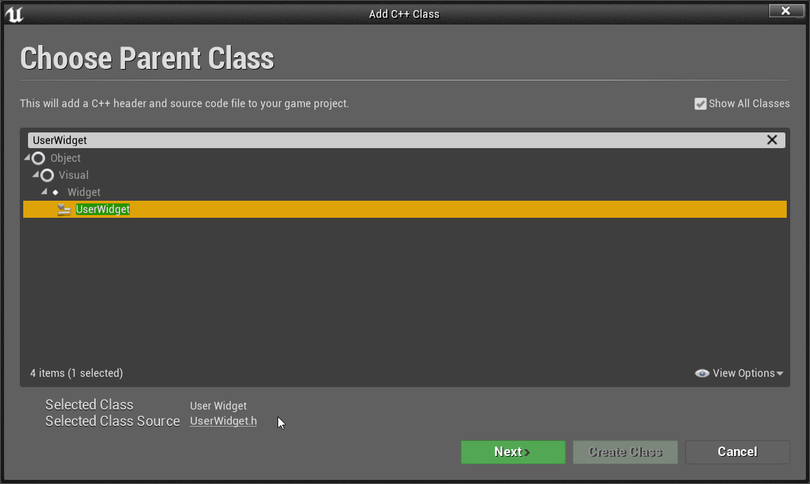
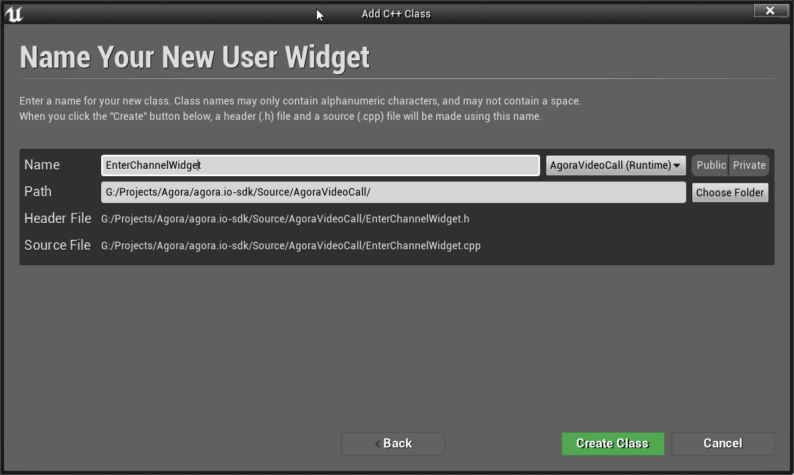

We get something like this:

```cpp
//EnterChannelWidget.h

#include "CoreMinimal.h"
#include "Blueprint/UserWidget.h"
#include "EnterChannelWidget.generated.h"

UCLASS()
class AGORAVIDEOCALL_API UEnterChannelWidget : public UUserWidget
{
	GENERATED_BODY()
	
};
```

- [Add Requered Includes](#add-requered-includes)
- [Add Member Variables](#add-member-variables)
- [Add Constructor and Construct/Destruct Methods](#add-constructor-and-constructdestruct-methods)
- [Add Setter Methods](#add-setter-methods)
- [Add BlueprintCallable Methods](#add-blueprintcallable-methods)
- [Add Update Methods](#add-update-methods)

##### Add Requered Includes
On the top of the **EnterChannelWidget.h** file include required header files and forvard declarations:

```cpp
//EnterCahnnelWidget.h

#include "CoreMinimal.h"
#include "Blueprint/UserWidget.h"
#include "Components/TextBlock.h"
#include "Components/RichTextBlock.h"
#include "Components/EditableTextBox.h"
#include "Components/ComboBoxString.h"
#include "Components/Button.h"
#include "Components/Image.h"

#include "VideoCall.h"

#include "EnterChannelWidget.generated.h"

class AVideoCallPlayerController;
```

```cpp
//EnterCahnnelWidget.cpp

#include "Blueprint/WidgetTree.h"

#include "VideoCallPlayerController.h"
```

##### Add Member Variables
Now add the next member variables:

```cpp
//EnterChannelWidget.h

...

UCLASS()
class AGORAVIDEOCALL_API UEnterChannelWidget : public UUserWidget
{
	GENERATED_BODY()

public:

	UPROPERTY(VisibleAnywhere, BlueprintReadOnly, meta = (BindWidget))
		UTextBlock* HeaderTextBlock = nullptr;

	UPROPERTY(VisibleAnywhere, BlueprintReadOnly, meta = (BindWidget))
		UTextBlock* DescriptionTextBlock = nullptr;

	UPROPERTY(VisibleAnywhere, BlueprintReadOnly, meta = (BindWidget))
		UEditableTextBox* ChannelNameTextBox = nullptr;

	UPROPERTY(VisibleAnywhere, BlueprintReadOnly, meta = (BindWidget))
		UEditableTextBox* EncriptionKeyTextBox = nullptr;

	UPROPERTY(VisibleAnywhere, BlueprintReadOnly, meta = (BindWidget))
		UTextBlock* EncriptionTypeTextBlock = nullptr;

	UPROPERTY(VisibleAnywhere, BlueprintReadOnly, meta = (BindWidget))
		UComboBoxString* EncriptionTypeComboBox = nullptr;

	UPROPERTY(VisibleAnywhere, BlueprintReadOnly, meta = (BindWidget))
		UButton* JoinButton = nullptr;

	UPROPERTY(VisibleAnywhere, BlueprintReadOnly, meta = (BindWidget))
		UButton* TestButton = nullptr;

	UPROPERTY(VisibleAnywhere, BlueprintReadOnly, meta = (BindWidget))
		UButton* VideoSettingsButton = nullptr;

	UPROPERTY(VisibleAnywhere, BlueprintReadOnly, meta = (BindWidget))
		UTextBlock* ContactsTextBlock = nullptr;

	UPROPERTY(VisibleAnywhere, BlueprintReadOnly, meta = (BindWidget))
		UTextBlock* BuildInfoTextBlock = nullptr;
		
	...
};
```

These variables needed to control the corresponding UI elements in the blueprint asset. The most important here is BindWidget meta property.
By marking a pointer to a widget as BindWidget, you can create an identically-named widget in a Blueprint subclass of your C++ class, and at run-time access it from the C++.

Add also the next members:

```cpp
//EnterChannelWidget.h

...

UCLASS()
class AGORAVIDEOCALL_API UEnterChannelWidget : public UUserWidget
{
	GENERATED_BODY()

	...
	
public:
	AVideoCallPlayerController* PlayerController = nullptr;

	TUniquePtr<VideoCall> VideoCallPtr;
	
	...
};
```

##### Add Constructor and Construct/Destruct Methods

```cpp
//EnterChannelWidget.h

...

UCLASS()
class AGORAVIDEOCALL_API UEnterChannelWidget : public UUserWidget
{
	GENERATED_BODY()

public:

	...
	
	UEnterChannelWidget(const FObjectInitializer& objectInitializer);

	void NativeConstruct() override;
	
	...
};
```

```cpp
//EnterChannelWidget.cpp

UEnterChannelWidget::UEnterChannelWidget(const FObjectInitializer& objectInitializer)
	: Super(objectInitializer)
{
}

void UEnterChannelWidget::NativeConstruct()
{
	Super::NativeConstruct();

	if (HeaderTextBlock)
		HeaderTextBlock->SetText(FText::FromString("Enter a conference room name"));

	if (DescriptionTextBlock)
		DescriptionTextBlock->SetText(FText::FromString("If you are the first person to specify this name, \
the room will be created and you will\nbe placed in it. \
If it has already been created you will join the conference in progress"));

	if (ChannelNameTextBox)
		ChannelNameTextBox->SetHintText(FText::FromString("Channel Name"));

	if (EncriptionKeyTextBox)
		EncriptionKeyTextBox->SetHintText(FText::FromString("Encription Key"));

	if (EncriptionTypeTextBlock)
		EncriptionTypeTextBlock->SetText(FText::FromString("Enc Type:"));

	if (EncriptionTypeComboBox)
	{
		EncriptionTypeComboBox->AddOption("aes-128");
		EncriptionTypeComboBox->AddOption("aes-256");
		EncriptionTypeComboBox->SetSelectedIndex(0);
	}

	if (JoinButton)
	{
		UTextBlock* JoinTextBlock = WidgetTree->ConstructWidget<UTextBlock>(UTextBlock::StaticClass());
		JoinTextBlock->SetText(FText::FromString("Join"));
		JoinButton->AddChild(JoinTextBlock);
		JoinButton->OnClicked.AddDynamic(this, &UEnterChannelWidget::OnJoin);
	}

	if (ContactsTextBlock)
		ContactsTextBlock->SetText(FText::FromString("agora.io Contact support: 400 632 6626"));

	if (BuildInfoTextBlock)
		BuildInfoTextBlock->SetText(FText::FromString(" "));
}
```

##### Add Setter Methods

To initialize PlayerController and VideoCallPtr variables

```cpp
//EnterChannelWidget.h

...

UCLASS()
class AGORAVIDEOCALL_API UEnterChannelWidget : public UUserWidget
{
	GENERATED_BODY()

public:

	...
	
	void SetVideoCallPlayerController(AVideoCallPlayerController* VideoCallPlayerController);

	void SetVideoCall(TUniquePtr<VideoCall> PassedVideoCallPtr);
	
	...
};
```

```cpp
//EnterChannelWidget.cpp

void UEnterChannelWidget::SetVideoCallPlayerController(AVideoCallPlayerController* VideoCallPlayerController)
{
	PlayerController = VideoCallPlayerController;
}

void UEnterChannelWidget::SetVideoCall(TUniquePtr<VideoCall> PassedVideoCallPtr)
{
	VideoCallPtr = std::move(PassedVideoCallPtr);
}
```

##### Add BlueprintCallable Methods

To react on the corresponding button 'onButtonClick' event:

```cpp
//EnterChannelWidget.h

...

UCLASS()
class AGORAVIDEOCALL_API UEnterChannelWidget : public UUserWidget
{
	GENERATED_BODY()

public:

	...

	UFUNCTION(BlueprintCallable)
		void OnJoin();
		
	...
};
```

```cpp
//EnterChannelWidget.cpp

void UEnterChannelWidget::OnJoin()
{
	if (!PlayerController || !VideoCallPtr)
	{
		return;
	}

	FString ChannelName = ChannelNameTextBox->GetText().ToString();

	FString EncryptionKey = EncriptionKeyTextBox->GetText().ToString();
	FString EncryptionType = EncriptionTypeComboBox->GetSelectedOption();

	SetVisibility(ESlateVisibility::Collapsed);

	PlayerController->StartCall(
		std::move(VideoCallPtr),
		ChannelName,
		EncryptionKey,
		EncryptionType);
}
```

##### Add Update Methods

```cpp
//EnterChannelWidget.h

...

UCLASS()
class AGORAVIDEOCALL_API UEnterChannelWidget : public UUserWidget
{
	GENERATED_BODY()

public:

	...
	
	void UpdateVersionText(FString newValue);
	
	...
};
```

```cpp
//EnterChannelWidget.cpp

void UEnterChannelWidget::UpdateVersionText(FString newValue)
{
	if (BuildInfoTextBlock)
		BuildInfoTextBlock->SetText(FText::FromString(newValue));
}
```


### Create VideoViewWidget C++ Class.

VideoViewWidget is a class to store the dynamic texture and update it, using the RGBA buffer, received from VideoCall `OnLocalFrameCallback`/`OnRemoteFrameCallback` functions.

- [Create Class and Add Required Includes](#create-class-and-add-required-includes)
- [Add Member Variables](#add-member-variables)
- [Override NativeConstruct Method](#override-nativeconstruct-method)
- [Override NativeDestruct Method](#override-nativedestruct-method)
- [Override NativeTick Method](#override-nativetick-method)
- [Add UpdateBuffer Method](#add-updatebuffer-method)

##### Create Class and Add Required Includes

Create Widget C++ class as you did before, add required includes:

```cpp
//VideoViewWidget.h

#include "CoreMinimal.h"
#include "Blueprint/UserWidget.h"

#include "Components/Image.h"

#include "VideoViewWidget.generated.h"
```

```cpp
//VideoViewWidget.cpp

#include "EngineUtils.h"
#include "Engine/Texture2D.h"

#include <algorithm>
```

##### Add Member Variables

Buffer - Variable to store the RGBA buffer, Width, Height and BufferSize - params of the video frame.
RenderTargetImage - The image widget that allows you to display a Slate Brush, or texture or material in the UI. 
RenderTargetTexture - The dynamic texture, that we will update using the Buffer variable.
FUpdateTextureRegion2D - Specifies an update region for a texture
Brush - A brush which contains information about how to draw a Slate element. We will use it to draw RenderTargetTexture on RenderTargetImage.

```cpp
//VideoViewWidget.h

...

UCLASS()
class AGORAVIDEOCALL_API UVideoViewWidget : public UUserWidget
{
	GENERATED_BODY()

public:
	UPROPERTY(BlueprintReadOnly, meta = (BindWidget))
		UImage* RenderTargetImage = nullptr;

	UPROPERTY(EditDefaultsOnly)
		UTexture2D* RenderTargetTexture = nullptr;

	UTexture2D* CameraoffTexture = nullptr;

	uint8* Buffer = nullptr;
	uint32_t Width = 0;
	uint32_t Height = 0;
	uint32 BufferSize = 0;
	FUpdateTextureRegion2D* UpdateTextureRegion = nullptr;

	FSlateBrush Brush;

	FCriticalSection Mutex;
	
	...
};
```

##### Override NativeConstruct() Method

In the NativeConstruct we will initialize our image with default color.
To initialize our RenderTargetTexture we need to create the dynamic texture (Texture2D ) using a CreateTransient call.
Then allocate Buffer with BufferSize calculated as Width * Height * 4 ( to store the RGBA format, where each pixel can be represented using 4 bytes ).
To update our texture we can use a call to UpdateTextureRegions. One of the input parameters to this function is our pixel data buffer.
So that whenever we modified the pixel data buffer we need to call this function to make the change visible in the texture.
Now initialize the Brush variable with our RenderTargetTexture, and then set this Brush in RenderTargetImage widget.

```cpp
//VideoViewWidget.h

...

UCLASS()
class AGORAVIDEOCALL_API UVideoViewWidget : public UUserWidget
{
	GENERATED_BODY()

public:

...

	void NativeConstruct() override;

	...
};
```
 
```cpp
//VideoViewWidget.cpp

void UVideoViewWidget::NativeConstruct()
{
	Super::NativeConstruct();

	Width = 640;
	Height = 360;

	RenderTargetTexture = UTexture2D::CreateTransient(Width, Height, PF_R8G8B8A8);
	RenderTargetTexture->UpdateResource();

	BufferSize = Width * Height * 4;
	Buffer = new uint8[BufferSize];
	for (uint32 i = 0; i < Width * Height; ++i)
	{
		Buffer[i * 4 + 0] = 0x32;
		Buffer[i * 4 + 1] = 0x32;
		Buffer[i * 4 + 2] = 0x32;
		Buffer[i * 4 + 3] = 0xFF;
	}
	UpdateTextureRegion = new FUpdateTextureRegion2D(0, 0, 0, 0, Width, Height);
	RenderTargetTexture->UpdateTextureRegions(0, 1, UpdateTextureRegion, Width * 4, (uint32)4, Buffer);

	Brush.SetResourceObject(RenderTargetTexture);
	RenderTargetImage->SetBrush(Brush);
}
```

##### Override NativeDestruct() Method

```cpp
//VideoViewWidget.h

...

UCLASS()
class AGORAVIDEOCALL_API UVideoViewWidget : public UUserWidget
{
	GENERATED_BODY()

public:

	...

	void NativeDestruct() override;

	...
};
```

```cpp
//VideoViewWidget.cpp

void UVideoViewWidget::NativeDestruct()
{
	Super::NativeDestruct();

	delete[] Buffer;
	delete UpdateTextureRegion;
}
```

##### Override NativeTick() Method

In case UpdateTextureRegion Width or Height are not equal to the memember Width Height values we need to recreate RenderTargetTexture to support the updated values,
and repeat initialization like in the Native Construct member.
Otherwise just call UpdateTextureRegions with Buffer.

```cpp
//VideoViewWidget.h

...

UCLASS()
class AGORAVIDEOCALL_API UVideoViewWidget : public UUserWidget
{
	GENERATED_BODY()

public:

	...
	
	void NativeTick(const FGeometry& MyGeometry, float DeltaTime) override;
	
	...
};
```

```cpp
//VideoViewWidget.cpp

void UVideoViewWidget::NativeTick(const FGeometry& MyGeometry, float DeltaTime)
{
	Super::NativeTick(MyGeometry, DeltaTime);

	FScopeLock lock(&Mutex);

	if (UpdateTextureRegion->Width != Width ||
		UpdateTextureRegion->Height != Height)
	{
		auto NewUpdateTextureRegion = new FUpdateTextureRegion2D(0, 0, 0, 0, Width, Height);

		auto NewRenderTargetTexture = UTexture2D::CreateTransient(Width, Height, PF_R8G8B8A8);
		NewRenderTargetTexture->UpdateResource();
		NewRenderTargetTexture->UpdateTextureRegions(0, 1, NewUpdateTextureRegion, Width * 4, (uint32)4, Buffer);

		Brush.SetResourceObject(NewRenderTargetTexture);
		RenderTargetImage->SetBrush(Brush);

		//UClass's such as UTexture2D are automatically garbage collected when there is no hard pointer references made to that object.
		//So if you just leave it and don't reference it elsewhere then it will be destroyed automatically.

		FUpdateTextureRegion2D* TmpUpdateTextureRegion = UpdateTextureRegion;

		RenderTargetTexture = NewRenderTargetTexture;
		UpdateTextureRegion = NewUpdateTextureRegion;

		delete TmpUpdateTextureRegion;
		return;
	}

	RenderTargetTexture->UpdateTextureRegions(0, 1, UpdateTextureRegion, Width * 4, (uint32)4, Buffer);
}
```

##### Add UpdateBuffer() Method

Called to update the Buffer value. We expect the new value to be received from Agora SDK thread, so due to UE4 limitation we save the value into the variable Buffer,
and update texture in the NativeTick method, and don't call UpdateTextureRegions here.

```cpp
//VideoViewWidget.h

...

UCLASS()
class AGORAVIDEOCALL_API UVideoViewWidget : public UUserWidget
{
	GENERATED_BODY()

public:

	...
	
	void UpdateBuffer( uint8* RGBBuffer, uint32_t Width, uint32_t Height, uint32_t Size );
	void ResetBuffer();
	...
};
```

```cpp
//VideoViewWidget.cpp 

void UVideoViewWidget::UpdateBuffer(
	uint8* RGBBuffer,
	uint32_t NewWidth,
	uint32_t NewHeight,
	uint32_t NewSize)
{
	FScopeLock lock(&Mutex);

	if (!RGBBuffer)
	{
		return;
	}

	if (BufferSize == NewSize)
	{
		std::copy(RGBBuffer, RGBBuffer + NewSize, Buffer);
	}
	else
	{
		delete[] Buffer;
		BufferSize = NewSize;
		Width = NewWidth;
		Height = NewHeight;
		Buffer = new uint8[BufferSize];
		std::copy(RGBBuffer, RGBBuffer + NewSize, Buffer);
	}
}

void UVideoViewWidget::ResetBuffer()
{
	for (uint32 i = 0; i < Width * Height; ++i)
	{
		Buffer[i * 4 + 0] = 0x32;
		Buffer[i * 4 + 1] = 0x32;
		Buffer[i * 4 + 2] = 0x32;
		Buffer[i * 4 + 3] = 0xFF;
	}
}
```


### Create VideoCallViewWidget C++ Class.

The VideoCallViewWidget class serves to display the local and remote user video.
We need two VideoViewWidget widgets, one to display video from the local camera, another to display video received from the remote user (assume we support only one remote user).

- [Create Class and Add Required Includes](#create-class-and-add-required-includes)
- [Add Member Variables](#add-member-variables)
- [Override NativeTick Method](#override-nativetick-method)
- [Add Update UpdateMainVideoBuffer/UpdateAdditionalVideoBuffer Methods](#add-update-updatemainvideobufferupdateaadditionalvideobuffer-methods)

##### Create Class and Add Required Includes

Create Widget C++ class as you did before, add required includes:

```cpp
//VideoCallViewWidget.h 

#include "CoreMinimal.h"
#include "Blueprint/UserWidget.h"
#include "Components/SizeBox.h"

#include "VideoViewWidget.h"

#include "VideoCallViewWidget.generated.h"
```

```cpp
//VideoCallViewWidget.cpp

#include "Components/CanvasPanelSlot.h"
```

##### Add Member Variables

```cpp
//VideoCallViewWidget.h 

...

UCLASS()
class AGORAVIDEOCALL_API UVideoCallViewWidget : public UUserWidget
{
	GENERATED_BODY()

public:
	
	UPROPERTY(BlueprintReadOnly, meta = (BindWidget))
		UVideoViewWidget* MainVideoViewWidget = nullptr;

	UPROPERTY(BlueprintReadOnly, meta = (BindWidget))
		USizeBox* MainVideoSizeBox = nullptr;

	UPROPERTY(BlueprintReadOnly, meta = (BindWidget))
		UVideoViewWidget* AdditionalVideoViewWidget = nullptr;

	UPROPERTY(BlueprintReadOnly, meta = (BindWidget))
		USizeBox* AdditionalVideoSizeBox = nullptr;

public:
	int32 MainVideoWidth = 0;
	int32 MainVideoHeight = 0;
	
	...
};
```

##### Override NativeTick() Method

In NativeTick we update the widgets geometry
```cpp
//VideoCallViewWidget.h 

...

UCLASS()
class AGORAVIDEOCALL_API UVideoCallViewWidget : public UUserWidget
{
	GENERATED_BODY()

public:

	...
	
	void NativeTick(const FGeometry& MyGeometry, float DeltaTime) override;
	
	...
};
```

```cpp
//VideoCallViewWidget.cpp

void UVideoCallViewWidget::NativeTick(const FGeometry& MyGeometry, float DeltaTime)
{
	Super::NativeTick(MyGeometry, DeltaTime);

	auto ScreenSize = MyGeometry.GetLocalSize();

	if (MainVideoHeight != 0)
	{
		float AspectRatio = 0;
		AspectRatio = MainVideoWidth / (float)MainVideoHeight;

		auto MainVideoGeometry = MainVideoViewWidget->GetCachedGeometry();
		auto MainVideoScreenSize = MainVideoGeometry.GetLocalSize();
		if (MainVideoScreenSize.X == 0)
		{
			return;
		}

		auto NewMainVideoHeight = MainVideoScreenSize.Y;
		auto NewMainVideoWidth = AspectRatio * NewMainVideoHeight;

		MainVideoSizeBox->SetMinDesiredWidth(NewMainVideoWidth);
		MainVideoSizeBox->SetMinDesiredHeight(NewMainVideoHeight);

		UCanvasPanelSlot* CanvasSlot = Cast<UCanvasPanelSlot>(MainVideoSizeBox->Slot);
		CanvasSlot->SetAutoSize(true);

		FVector2D NewPosition;
		NewPosition.X = -NewMainVideoWidth / 2;
		NewPosition.Y = -NewMainVideoHeight / 2;
		CanvasSlot->SetPosition(NewPosition);
	}
}
```

##### Add Update UpdateMainVideoBuffer/UpdateAdditionalVideoBuffer Methods

```cpp
//VideoCallViewWidget.h 

...

UCLASS()
class AGORAVIDEOCALL_API UVideoCallViewWidget : public UUserWidget
{
	GENERATED_BODY()

public:

	...
	
	void UpdateMainVideoBuffer( uint8* RGBBuffer, uint32_t Width, uint32_t Height, uint32_t Size);
	void UpdateAdditionalVideoBuffer( uint8* RGBBuffer, uint32_t Width, uint32_t Height, uint32_t Size);
	
	void ResetBuffers();
	...
};
```

```cpp
//VideoCallViewWidget.cpp

void UVideoCallViewWidget::UpdateMainVideoBuffer(
	uint8* RGBBuffer,
	uint32_t Width,
	uint32_t Height,
	uint32_t Size)
{
	if (!MainVideoViewWidget)
	{
		return;
	}
	MainVideoWidth = Width;
	MainVideoHeight = Height;
	MainVideoViewWidget->UpdateBuffer(RGBBuffer, Width, Height, Size);
}

void UVideoCallViewWidget::UpdateAdditionalVideoBuffer(
	uint8* RGBBuffer,
	uint32_t Width,
	uint32_t Height,
	uint32_t Size)
{
	if (!AdditionalVideoViewWidget)
	{
		return;
	}
	AdditionalVideoViewWidget->UpdateBuffer(RGBBuffer, Width, Height, Size);
}

void UVideoCallViewWidget::ResetBuffers()
{
	if (!MainVideoViewWidget || !AdditionalVideoViewWidget)
	{
		return;
	}
	MainVideoViewWidget->ResetBuffer();
	AdditionalVideoViewWidget->ResetBuffer();
}
```


### Create VideoCallWidget C++ Class.

The VideoCallWidget class serves as the audio/video call widget for the sample application.
It contains the following controls, binded with UI elements in blueprint asset:

- The local and remote video view( represented by VideoCallViewWidget )
- The end-call button( EndCallButton variable )
- The mute-local-audio button( MuteLocalAudioButton variable )
- The video-mode button( VideoModeButton variable )

 
- [Create Class and Add Required Includes](#create-class-and-add-required-includes)
- [Add Member Variables](#add-member-variables)
- [Initialize VideoCallWidget](#initialize-videocallwidget)
- [Add Button Textures](#add-button-textures)
- [Add Setters](#add-setters)
- [Add Methods to Update Buttons View ](#add-methods-to-update-buttons-view)
- [Add OnStartCall Method](#add-onstartcall-method)
- [Add OnEndCall Method](#add-onendcall-method)
- [Add OnMuteLocalAudio Method](#add-onmutelocalaudio-method)
- [Add OnChangeVideoMode Method](#add-onchangevideomode-method)

##### Create Class and Add Required Includes

Create Widget C++ class as you did before, add required includes and forward declarations:

```cpp
//VideoCallWidget.h
#include "CoreMinimal.h"
#include "Blueprint/UserWidget.h"

#include "Templates/UniquePtr.h"
#include "Components/Image.h"
#include "Components/Button.h"
#include "Engine/Texture2D.h"

#include "VideoCall.h"

#include "VideoCallViewWidget.h"

#include "VideoCallWidget.generated.h"

class AVideoCallPlayerController;
class UVideoViewWidget;
```

```cpp
//VideoCallWidget.cpp

#include "Kismet/GameplayStatics.h"
#include "UObject/ConstructorHelpers.h"
#include "Components/CanvasPanelSlot.h"

#include "VideoViewWidget.h"

#include "VideoCallPlayerController.h"
```

##### Add Member Variables

```cpp
//VideoCallWidget.h

...

UCLASS()
class AGORAVIDEOCALL_API UVideoCallWidget : public UUserWidget
{
	GENERATED_BODY()

public:
	AVideoCallPlayerController* PlayerController = nullptr;

public:
	UPROPERTY(BlueprintReadOnly, meta = (BindWidget))
		UVideoCallViewWidget* VideoCallViewWidget = nullptr;

	//Buttons
	UPROPERTY(BlueprintReadOnly, meta = (BindWidget))
		UButton* EndCallButton = nullptr;
	UPROPERTY(BlueprintReadOnly, meta = (BindWidget))
		UButton* MuteLocalAudioButton = nullptr;
	UPROPERTY(BlueprintReadOnly, meta = (BindWidget))
		UButton* VideoModeButton = nullptr;

	//Button textures
	int32 ButtonSizeX = 96;
	int32 ButtonSizeY = 96;
	UTexture2D* EndCallButtonTexture = nullptr;
	UTexture2D* AudioButtonMuteTexture = nullptr;
	UTexture2D* AudioButtonUnmuteTexture = nullptr;
	UTexture2D* VideomodeButtonCameraoffTexture = nullptr;
	UTexture2D* VideomodeButtonCameraonTexture = nullptr;

	TUniquePtr<VideoCall> VideoCallPtr;
	
	...
};
```

##### Initialize VideoCallWidget

Find asset image for each button and assigne it to corresponding texture. Then initialize each button with textures.

```cpp
//VideoCallWidget.h

...

UCLASS()
class AGORAVIDEOCALL_API UVideoCallWidget : public UUserWidget
{
	GENERATED_BODY()

public:

	...

	UVideoCallWidget(const FObjectInitializer& ObjectInitializer);

	void NativeConstruct() override;
	void NativeDestruct() override;

private:
	void InitButtons();
	
	...
};
```

```cpp
//VideoCallWidget.cpp 

void UVideoCallWidget::NativeConstruct()
{
	Super::NativeConstruct();

	InitButtons();
}

void UVideoCallWidget::NativeDestruct()
{
	Super::NativeDestruct();

	if (VideoCallPtr)
	{
		VideoCallPtr->StopCall();
	}
}

UVideoCallWidget::UVideoCallWidget(const FObjectInitializer& ObjectInitializer)
	: Super(ObjectInitializer)
{
	static ConstructorHelpers::FObjectFinder<UTexture2D>
		EndCallButtonTextureFinder(TEXT("Texture'/Game/ButtonTextures/hangup.hangup'"));
	if (EndCallButtonTextureFinder.Succeeded())
	{
		EndCallButtonTexture = EndCallButtonTextureFinder.Object;
	}
	static ConstructorHelpers::FObjectFinder<UTexture2D>
		AudioButtonMuteTextureFinder(TEXT("Texture'/Game/ButtonTextures/mute.mute'"));
	if (AudioButtonMuteTextureFinder.Succeeded())
	{
		AudioButtonMuteTexture = AudioButtonMuteTextureFinder.Object;
	}
	static ConstructorHelpers::FObjectFinder<UTexture2D>
		AudioButtonUnmuteTextureFinder(TEXT("Texture'/Game/ButtonTextures/unmute.unmute'"));
	if (AudioButtonUnmuteTextureFinder.Succeeded())
	{
		AudioButtonUnmuteTexture = AudioButtonUnmuteTextureFinder.Object;
	}
	static ConstructorHelpers::FObjectFinder<UTexture2D>
		VideomodeButtonCameraonTextureFinder(TEXT("Texture'/Game/ButtonTextures/cameraon.cameraon'"));
	if (VideomodeButtonCameraonTextureFinder.Succeeded())
	{
		VideomodeButtonCameraonTexture = VideomodeButtonCameraonTextureFinder.Object;
	}
	static ConstructorHelpers::FObjectFinder<UTexture2D>
		VideomodeButtonCameraoffTextureFinder(TEXT("Texture'/Game/ButtonTextures/cameraoff.cameraoff'"));
	if (VideomodeButtonCameraoffTextureFinder.Succeeded())
	{
		VideomodeButtonCameraoffTexture = VideomodeButtonCameraoffTextureFinder.Object;
	}
}

void UVideoCallWidget::InitButtons()
{
	if (EndCallButtonTexture)
	{
		EndCallButton->WidgetStyle.Normal.SetResourceObject(EndCallButtonTexture);
		EndCallButton->WidgetStyle.Normal.ImageSize = FVector2D(ButtonSizeX, ButtonSizeY);
		EndCallButton->WidgetStyle.Normal.DrawAs = ESlateBrushDrawType::Type::Image;

		EndCallButton->WidgetStyle.Hovered.SetResourceObject(EndCallButtonTexture);
		EndCallButton->WidgetStyle.Hovered.ImageSize = FVector2D(ButtonSizeX, ButtonSizeY);
		EndCallButton->WidgetStyle.Hovered.DrawAs = ESlateBrushDrawType::Type::Image;

		EndCallButton->WidgetStyle.Pressed.SetResourceObject(EndCallButtonTexture);
		EndCallButton->WidgetStyle.Pressed.ImageSize = FVector2D(ButtonSizeX, ButtonSizeY);
		EndCallButton->WidgetStyle.Pressed.DrawAs = ESlateBrushDrawType::Type::Image;
	}
	EndCallButton->OnClicked.AddDynamic(this, &UVideoCallWidget::OnEndCall);

	SetAudioButtonToMute();
	MuteLocalAudioButton->OnClicked.AddDynamic(this, &UVideoCallWidget::OnMuteLocalAudio);

	SetVideoModeButtonToCameraOff();
	VideoModeButton->OnClicked.AddDynamic(this, &UVideoCallWidget::OnChangeVideoMode);

}
```

##### Add Button Textures

Find directory **Content/ButtonTextures** in demo application (you dont have to open the project, simply find this folder in filesystem).
All button textures are stored there.
In your project content create new directory called **ButtonTextures**, drag and drop all button images there to make them available in your project.

##### Add Setters

```cpp
//VideoCallWidget.h

...

UCLASS()
class AGORAVIDEOCALL_API UVideoCallWidget : public UUserWidget
{
	GENERATED_BODY()

	...
	
public:
	void SetVideoCallPlayerController(AVideoCallPlayerController* VideoCallPlayerController);
	void SetVideoCall(TUniquePtr<VideoCall> PassedVideoCallPtr);

	...
};
```

```cpp
//VideoCallWidget.cpp

void UVideoCallWidget::SetVideoCallPlayerController(AVideoCallPlayerController* VideoCallPlayerController)
{
	PlayerController = VideoCallPlayerController;
}

void UVideoCallWidget::SetVideoCall(TUniquePtr<VideoCall> PassedVideoCallPtr)
{
	VideoCallPtr = std::move(PassedVideoCallPtr);
}
```

##### Add Methods to Update Buttons View 

```cpp
//VideoCallWidget.h

...

UCLASS()
class AGORAVIDEOCALL_API UVideoCallWidget : public UUserWidget
{
	GENERATED_BODY()

	...

private:
	
	void SetVideoModeButtonToCameraOff();
	void SetVideoModeButtonToCameraOn();

	void SetAudioButtonToMute();
	void SetAudioButtonToUnMute();
		
	...
};
```

```cpp
//VideoCallWidget.cpp

void UVideoCallWidget::SetVideoModeButtonToCameraOff()
{
	if (VideomodeButtonCameraoffTexture)
	{
		VideoModeButton->WidgetStyle.Normal.SetResourceObject(VideomodeButtonCameraoffTexture);
		VideoModeButton->WidgetStyle.Normal.ImageSize = FVector2D(ButtonSizeX, ButtonSizeY);
		VideoModeButton->WidgetStyle.Normal.DrawAs = ESlateBrushDrawType::Type::Image;

		VideoModeButton->WidgetStyle.Hovered.SetResourceObject(VideomodeButtonCameraoffTexture);
		VideoModeButton->WidgetStyle.Hovered.ImageSize = FVector2D(ButtonSizeX, ButtonSizeY);
		VideoModeButton->WidgetStyle.Hovered.DrawAs = ESlateBrushDrawType::Type::Image;

		VideoModeButton->WidgetStyle.Pressed.SetResourceObject(VideomodeButtonCameraoffTexture);
		VideoModeButton->WidgetStyle.Pressed.ImageSize = FVector2D(ButtonSizeX, ButtonSizeY);
		VideoModeButton->WidgetStyle.Pressed.DrawAs = ESlateBrushDrawType::Type::Image;
	}
}

void UVideoCallWidget::SetVideoModeButtonToCameraOn()
{
	if (VideomodeButtonCameraonTexture)
	{
		VideoModeButton->WidgetStyle.Normal.SetResourceObject(VideomodeButtonCameraonTexture);
		VideoModeButton->WidgetStyle.Normal.ImageSize = FVector2D(ButtonSizeX, ButtonSizeY);
		VideoModeButton->WidgetStyle.Normal.DrawAs = ESlateBrushDrawType::Type::Image;

		VideoModeButton->WidgetStyle.Hovered.SetResourceObject(VideomodeButtonCameraonTexture);
		VideoModeButton->WidgetStyle.Hovered.ImageSize = FVector2D(ButtonSizeX, ButtonSizeY);
		VideoModeButton->WidgetStyle.Hovered.DrawAs = ESlateBrushDrawType::Type::Image;

		VideoModeButton->WidgetStyle.Pressed.SetResourceObject(VideomodeButtonCameraonTexture);
		VideoModeButton->WidgetStyle.Pressed.ImageSize = FVector2D(ButtonSizeX, ButtonSizeY);
		VideoModeButton->WidgetStyle.Pressed.DrawAs = ESlateBrushDrawType::Type::Image;
	}
}

void UVideoCallWidget::SetAudioButtonToMute()
{
	if (AudioButtonMuteTexture)
	{
		MuteLocalAudioButton->WidgetStyle.Normal.SetResourceObject(AudioButtonMuteTexture);
		MuteLocalAudioButton->WidgetStyle.Normal.ImageSize = FVector2D(ButtonSizeX, ButtonSizeY);
		MuteLocalAudioButton->WidgetStyle.Normal.DrawAs = ESlateBrushDrawType::Type::Image;

		MuteLocalAudioButton->WidgetStyle.Hovered.SetResourceObject(AudioButtonMuteTexture);
		MuteLocalAudioButton->WidgetStyle.Hovered.ImageSize = FVector2D(ButtonSizeX, ButtonSizeY);
		MuteLocalAudioButton->WidgetStyle.Hovered.DrawAs = ESlateBrushDrawType::Type::Image;

		MuteLocalAudioButton->WidgetStyle.Pressed.SetResourceObject(AudioButtonMuteTexture);
		MuteLocalAudioButton->WidgetStyle.Pressed.ImageSize = FVector2D(ButtonSizeX, ButtonSizeY);
		MuteLocalAudioButton->WidgetStyle.Pressed.DrawAs = ESlateBrushDrawType::Type::Image;
	}
}

void UVideoCallWidget::SetAudioButtonToUnMute()
{
	if (AudioButtonUnmuteTexture)
	{
		MuteLocalAudioButton->WidgetStyle.Normal.SetResourceObject(AudioButtonUnmuteTexture);
		MuteLocalAudioButton->WidgetStyle.Normal.ImageSize = FVector2D(ButtonSizeX, ButtonSizeY);
		MuteLocalAudioButton->WidgetStyle.Normal.DrawAs = ESlateBrushDrawType::Type::Image;

		MuteLocalAudioButton->WidgetStyle.Hovered.SetResourceObject(AudioButtonUnmuteTexture);
		MuteLocalAudioButton->WidgetStyle.Hovered.ImageSize = FVector2D(ButtonSizeX, ButtonSizeY);
		MuteLocalAudioButton->WidgetStyle.Hovered.DrawAs = ESlateBrushDrawType::Type::Image;

		MuteLocalAudioButton->WidgetStyle.Pressed.SetResourceObject(AudioButtonUnmuteTexture);
		MuteLocalAudioButton->WidgetStyle.Pressed.ImageSize = FVector2D(ButtonSizeX, ButtonSizeY);
		MuteLocalAudioButton->WidgetStyle.Pressed.DrawAs = ESlateBrushDrawType::Type::Image;
	}
}
```

##### Add OnStartCall Method

```cpp
//VideoCallWidget.h

...

UCLASS()
class AGORAVIDEOCALL_API UVideoCallWidget : public UUserWidget
{
	GENERATED_BODY()

public:

	...
	
	void OnStartCall( const FString& ChannelName, const FString& EncryptionKey, const FString& EncryptionType );

	...
};
```

```cpp
//VideoCallWidget.cpp

void UVideoCallWidget::OnStartCall(
	const FString& ChannelName,
	const FString& EncryptionKey,
	const FString& EncryptionType)
{
	if (!VideoCallPtr)
	{
		return;
	}

	auto OnLocalFrameCallback = [this](
		std::uint8_t* Buffer,
		std::uint32_t Width,
		std::uint32_t Height,
		std::uint32_t Size)
	{
		VideoCallViewWidget->UpdateAdditionalVideoBuffer(Buffer, Width, Height, Size);
	};
	VideoCallPtr->RegisterOnLocalFrameCallback(OnLocalFrameCallback);

	auto OnRemoteFrameCallback = [this](
		std::uint8_t* Buffer,
		std::uint32_t Width,
		std::uint32_t Height,
		std::uint32_t Size)
	{
		VideoCallViewWidget->UpdateMainVideoBuffer(Buffer, Width, Height, Size);
	};
	VideoCallPtr->RegisterOnRemoteFrameCallback(OnRemoteFrameCallback);

	VideoCallPtr->StartCall(ChannelName, EncryptionKey, EncryptionType);
}
```

##### Add OnEndCall Method

```cpp
//VideoCallWidget.h

...

UCLASS()
class AGORAVIDEOCALL_API UVideoCallWidget : public UUserWidget
{
	GENERATED_BODY()

public:

	...
	
	UFUNCTION(BlueprintCallable)
	void OnEndCall();
	
	...
};
```

```cpp
//VideoCallWidget.cpp 

void UVideoCallWidget::OnEndCall()
{
	if (VideoCallPtr)
	{
		VideoCallPtr->StopCall();
	}

	if (VideoCallViewWidget)
	{
		VideoCallViewWidget->ResetBuffers();
	}

	if (PlayerController)
	{
		SetVisibility(ESlateVisibility::Collapsed);
		PlayerController->EndCall(std::move(VideoCallPtr));
	}
}
```

##### Add OnMuteLocalAudio Method

```cpp
//VideoCallWidget.h

...

UCLASS()
class AGORAVIDEOCALL_API UVideoCallWidget : public UUserWidget
{
	GENERATED_BODY()

public:

	...
	
	UFUNCTION(BlueprintCallable)
	void OnMuteLocalAudio();

	...
};
```

```cpp
//VideoCallWidget.cpp

void UVideoCallWidget::OnMuteLocalAudio()
{
	if (!VideoCallPtr)
	{
		return;
	}
	if (VideoCallPtr->IsLocalAudioMuted())
	{
		VideoCallPtr->MuteLocalAudio(false);
		SetAudioButtonToMute();
	}
	else
	{
		VideoCallPtr->MuteLocalAudio(true);
		SetAudioButtonToUnMute();
	}
}
```

##### Add OnChangeVideoMode Method

```cpp
//VideoCallWidget.h

...

UCLASS()
class AGORAVIDEOCALL_API UVideoCallWidget : public UUserWidget
{
	GENERATED_BODY()

public:

	...
	
	UFUNCTION(BlueprintCallable)
	void OnChangeVideoMode();
	
	...
};
```

```cpp
//VideoCallWidget.cpp

void UVideoCallWidget::OnChangeVideoMode()
{
	if (!VideoCallPtr)
	{
		return;
	}
	if (!VideoCallPtr->IsLocalVideoMuted())
	{
		VideoCallPtr->MuteLocalVideo(true);

		SetVideoModeButtonToCameraOn();
	}
	else
	{
		VideoCallPtr->EnableVideo(true);
		VideoCallPtr->MuteLocalVideo(false);

		SetVideoModeButtonToCameraOff();
	}
}
```

## Create Blueprint Classes

Make sure C++ code compiles properly. Without successfuly compiled project you will not be able to do the next steps.
You you have compiled c++ code successfuly and still do not see required classes in Unreal Editor try to reopen the project.

### Create BP_EnterChannelWidget blueprint asset

Create a Blueprint of UEnterChannelWidget
Right-click on the **Content**, Select the **User Interface** menu and select **Widget Blueprint**.

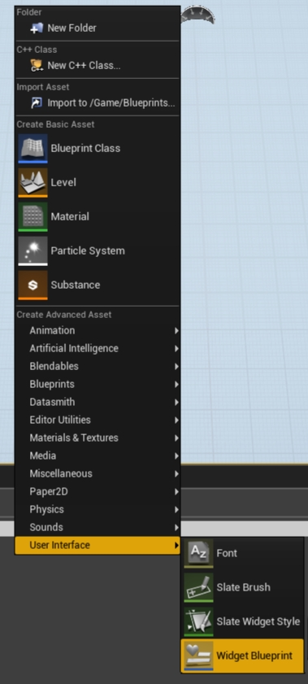

Change the parent of the class of this new User Widget. 
Open the Blueprint, the UMG Editor Interface appears, and by default it opens to the **Designer** tab. Click on the **Graph** button (right top corner button) and select **Class Settings**.
On the panel **Details**, click on the drop-down list **Parent Class** and select the C++ class previously created, UEnterChannelWidget.
Now return to the **Designer** tab. The **Palette** window contains several different types of widgets that you can use to construct your UI elements. 
Find **Text**, **Editable Text**, **Button** and **ComboBox (String)** elements, then drag them to the workspace as you see on the picture.
Then go to the definition of UEnterChannelWidget in "EnterChannelWidget.h" file to see the names of the member variables with the corresponding types(UTextBlock, UEditableTextBox, UButton and UComboBoxString). 
Return to the BP_VideoCallWiewVidget editor and set same names to UI elements that you have dragged. 
You can do this by clicking on the element and changing the name in the Details panel. Try to compile the blueprint. 
You will be shown an error if you forgot to add something, or if there is widget name/type mismatch inside your UserWidget class.

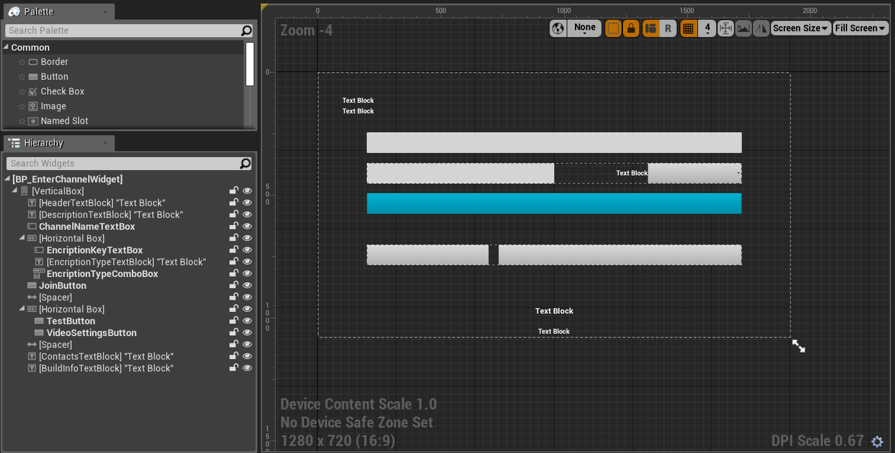

Save it to the prefered folder, for example like /Content/Widgets/BP_EnterChannelWidget.uasset

### Create BP_VideoViewWidget Asset.

Create BP_VideoViewWidget Asset, set parent class to UVideoViewWidget, and Image element, call it RenderTargetImage.

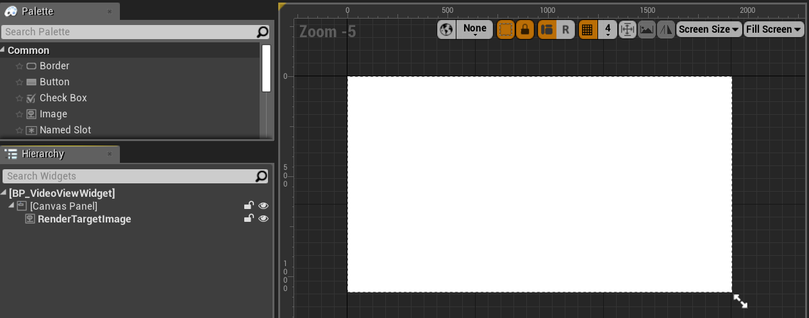

Its important to set image anchor here:

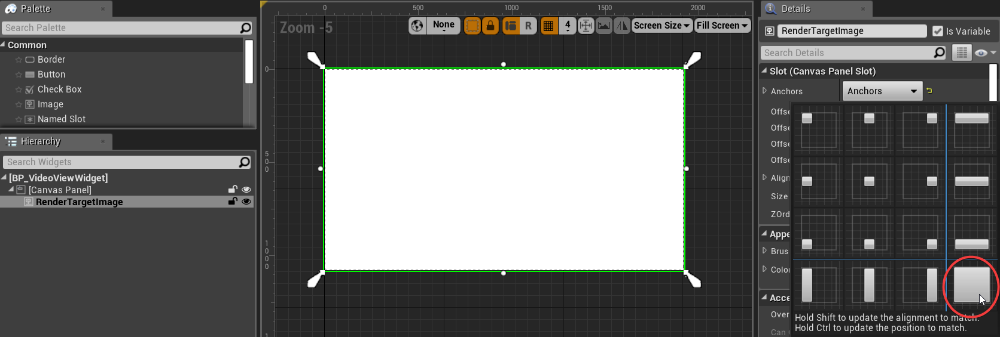

### Create BP_VideoCallViewWidget Asset.

Create BP_VideoCallViewWidget Asset, set parent class to UVideoCallViewWidget, and add UI elements MainVideoViewWidget and AdditionalVideoViewWidget of BP_VideoViewWidget type.
Also add MainVideoSizeBox and AdditionalVideoSizeBox UI element of SizeBox type.

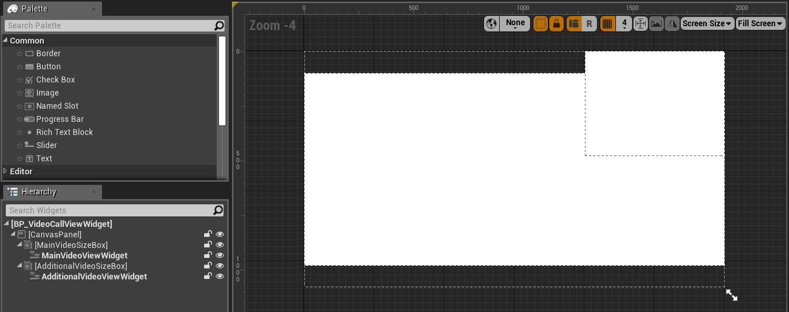

### Create BP_VideoCallWidget Asset.

Create BP_VideoCallWidget Asset, set parent class to UVideoCallWidget, find in Palette UI element BP_VideoCallViewWidget and add with name VideoCallViewWidget,
add EndCallButton, MuteLocalAudioButton and VideoModeButton buttons.

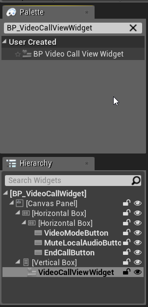

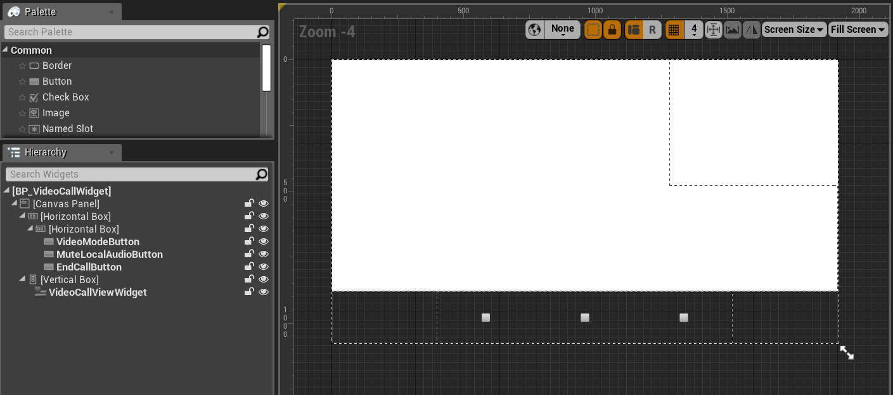


### Create BP_VideoCallPlayerController blueprint asset

Now it's time to create BP_VideoCallPlayerController blueprint asset, based on the AVideoCallPlayerController class that we described earlier


Create a Blueprint of AVideoCallPlayerController: 
Right-click on the **Content**, press the **Add New** button, select the **Blueprint Class**, in the window **Pick parent class** go to the **All classes** section, and find the VideoCallPlayerController class.

Now assign our previously created widgets to the PlayerController as shown in the following image:

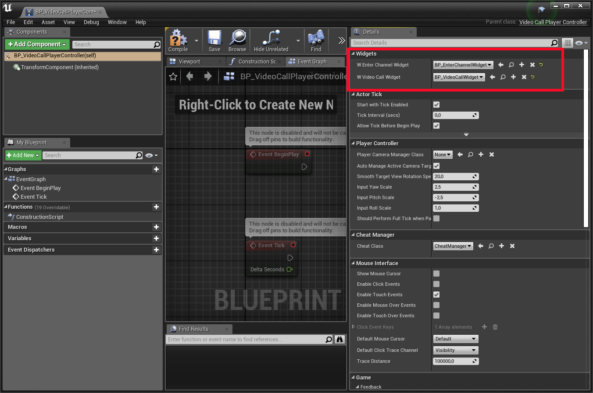

Save it to the prefered folder, for example like /Content/Widgets/BP_VideoCallPlayerController.uasset


### Create BP_AgoraVideoCallGameModeBase Asset.

Create a Blueprint of AVideoCallPlayerController
Right-click on the **Content**, press the **Add New** button, select the **Blueprint Class**, in the window **Pick parent class** 
select the **Game Mode Base** Class. This is the parent class for all Game Modes. 

#### Modify GameMode

Now you need to set your custom GameMode class and Player Controller. 
Go to the world settings and set the specified variables:
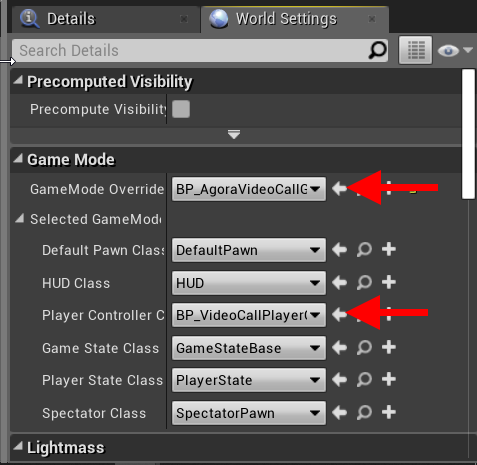

### Specify project settings

Go to **Edit->Project settings**, open **Maps & Modes** tab. Specify Default parameters:

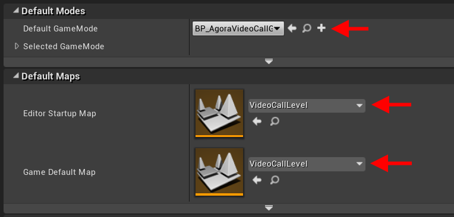